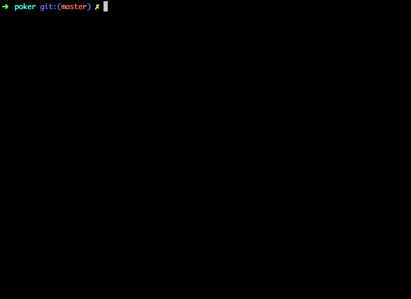

Poker Texas Holdem Cactus Kev's algorithm in JavaScript
=====

Evaluate the score (the lower the better) of a poker hand as described in this post blog : http://suffe.cool/poker/evaluator.html.
You can compare two poker hands to find out who wins or if it's a tie.

I've ported some part Cactus Kev's C code : http://suffe.cool/poker/code/

It works on browser side too although the lib is a little heavy ~102 Kb because of the use of lookup tables. But it's robust and really fast. You can evaluate all the cards combinations in few seconds.

### How to install

Node.js >= 6

```sh
npm install --save poker-hand-evaluator
```

### How to use

```js
const PokerHand = require('poker-hand-evaluator');

const myPokerHand = new PokerHand('KS KH QC AH AD');
const hisPokerHand = new PokerHand('KD KC AS AH TD')

console.log(myPokerHand.describe());
// { hand: [ 'KS', 'KH', 'QC', 'AH', 'AD' ],
//   score: 2468,
//   rank: 'TWO_PAIRS' }

console.log(hisPokerHand.describe());
// { hand: [ 'KD', 'KC', 'AS', 'AH', 'TD' ],
//   score: 2470,
//   rank: 'TWO_PAIRS' }

console.log(myPokerHand.getRank());
// TWO_PAIRS
console.log(hisPokerHand.getRank());
// TWO_PAIRS

console.log(myPokerHand.getScore());
// 2468
console.log(hisPokerHand.getScore());
// 2470

console.log(myPokerHand.toString());
// KS KH QC AH AD
console.log(hisPokerHand.toString());
// KD KC AS AH TD


/**
 * return 1 if it's a Win
 * return 2 if it's a Loss
 * return 3 if it's a Tie
 */
console.log(myPokerHand.compareWith(hisPokerHand));
// 1
```

### How to develop

Node.js >= 8.5.0 is necessary to run the tests

```sh
git clone https://github.com/codeKonami/poker-hand.git
cd poker-hand
# Install dev dependencies (Webpack, babel, Jest ...)
npm install
# Launch an example
npm run dev
```

### How to test

```sh
npm run test
```



This command will run the unit tests (through [Jest](https://facebook.github.io/jest/)) and will also evaluate the time it takes to evaluate all the combinations. Finally it will display 10 random comparisons.

### How to build

```sh
npm run build
```

This command generates a pokerhand.min.js file in the `dist/` folder to be used on browser. You can try an example of implementation on browser by launching a web server in the root folder.

```sh
python -m SimpleHTTPServer
# Now go to http://localhost:8000
```

### TO DO

- [ ] Load the C code of Kev Cactus directly in Node.js to compare the result between my code and his results.
- [ ] Add the Paul Senzee's optimisation mentioned in the blog post [here](http://www.paulsenzee.com/2006/06/some-perfect-hash.html)
